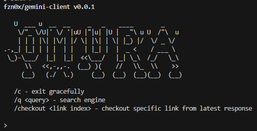

<div style="text-align:center">
    
</div>

## What is Omura?

Omura is a small-CLI small-client to access the [_Gemini Protocol_](https://geminiprotocol.net/) sites. A Gemtext-based Web Alternatives Protocol.

> Omura: 大村 / Large Village. It is a placename and surname found throughout Japan and the Ryūkyū Islands. The name listed in the Shinsen shōjiroku may be taken from a district in Hizen (now Nagasaki prefecture).

<div style="text-align:center">
    
</div>

## Why Omura?

Omura is simple (Only commands, yes, commands.) and extensible (powered by UNIST AST and TypeScript) project to access the [_Gemini Protocol_](https://geminiprotocol.net/) sites, it's easy to use, you can run below than 5 minutes, thanks to JavaScript runtime engines.

## How to run Omura?

### [Bunx](https://bun.sh/docs/cli/bunx) `recommended: v1.1.3`

```bash
bunx omura

# Fix `UNABLE_TO_VERIFY_LEAF_SIGNATURE: unable to verify the first certificate`
NODE_TLS_REJECT_UNAUTHORIZED=0 bunx omura

# Local development (Same directory)
NODE_TLS_REJECT_UNAUTHORIZED=0 bunx .
```

### [npx](https://nodejs.org/en/download) `recommended: v10.5.0`

```bash
npx omura
```

## Acknowledgments

Omura takes heavy inspiration from the following:

- [`@derhuerst/gemini`](https://github.com/derhuerst/gemini) ([Jannis R](https://github.com/derhuerst)) - Implementation of Gemini Client and Server in Node.js

- [`gemini://geminiprotocol.net/docs/protocol-specification.gmi`](https://geminiprotocol.net/docs/protocol-specification.gmi) ([Solderpunk - the man behind Gemini Protocol](https://zaibatsu.circumlunar.space/~solderpunk/)) - Gemini Protocol Specification

- [`@MasterQ2/kristall`](https://github.com/MasterQ32/kristall) ([MasterQ2](https://github.com/MasterQ32)) - Graphical Small-Internet Client for windows, linux, MacOS X and BSDs.

## License

Omura is [MIT-licensed](LICENSE) open-source software by [@fzn0x](https://fzn0x.dev).

<!-- and [contributors](https://github.com/fzn0x/omura/graphs/contributors):

<a href="https://github.com/fzn0x/omura/graphs/contributors">
  
</a> -->
